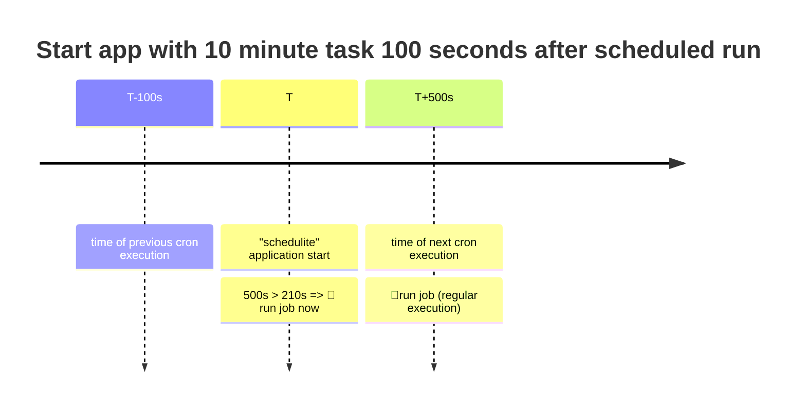
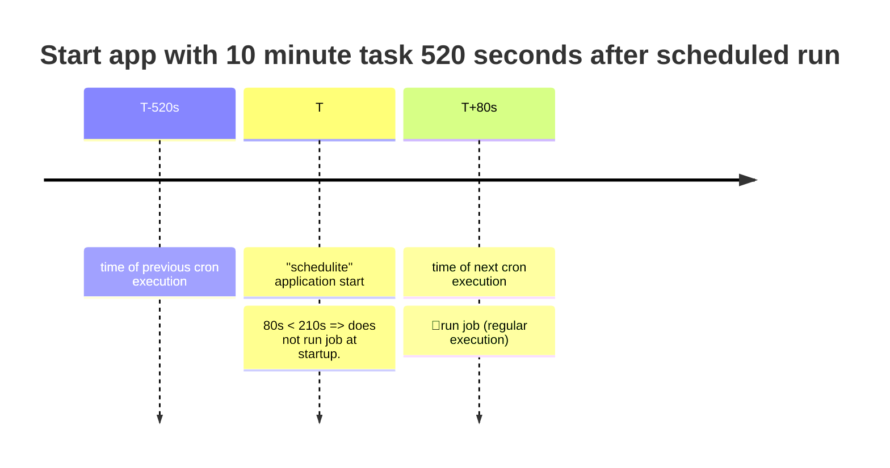

# Schedulite

A simple scheduler for light tasks.

⚠️ The sample tasks are file copy operations with some replacements. To do something more than copying files, you would need to code and add that behaviour yourself.

## Features

- configuration of tasks via a json file
- option to run task at application startup if time to cron job exceeds a configurable value
- monitoring and live reloading of the configuration file
- task config file and logger config file can be loaded either from current working directory or from running binary location.
- file name replacements with custom formatting.

## Configuration

The list of tasks to run is configured via a json file.
While most fields are straightforward, the frequency is defined according to the UNIX cron format

You can define the frequency of the task using the `frequency_cron_config` entry in the json file.
The frequency is configured via simple string, where the values are matched against values for seconds, minutes, hour, etc. For instance, this string defines a task that takes place every 10 seconds: `*/10 * * * * *`.

Some examples below:
| Sec  | Min  | Hour | Day of Month | Month | Day of week | Year | Description                  |
| :--- | :--- | :--- | :----------- | :---- | :---------- | :--- | :--------------------------- |
| */10 | *    | *    | *            | *     | *           | *    | Every 10 seconds             |
| 0    | *    | *    | *            | *     | *           | *    | Every minute                 |
| 0    | */10 | *    | *            | *     | *           | *    | Every 10 minutes             |
| 0    | 0    | *    | *            | *     | *           | *    | Every hour (at X:00:00)      |
| 0    | 0    | 0    | *            | *     | *           | *    | Every day (at 00:00:00)      |
| 0    | 20   | 18   | 3            | *     | *           | *    | Monthly, every 3rd, at 18:20 |

Further reading:

- <https://www.ibm.com/docs/en/db2oc?topic=task-unix-cron-format/> .
- <https://docs.rs/job_scheduler/latest/job_scheduler/>
- <https://crates.io/crates/job_scheduler_ng>

## Running the application

### Standalone

Run the application directly. You can specify some optional command line arguments.
Run schedulite --help to view the optional command line arguments:

```powershell
.\schedulite.exe --help
A simple scheduler for light tasks

Usage: schedulite.exe [OPTIONS]

Options:
      --config <FILE>  Sets a custom config file for the tasks to run [default: schedulite.json]
      --logcfg <FILE>  Sets a custom log file to write to [default: log4rs.yaml]
  -h, --help           Print help
  -V, --version        Print version

```

Running the scheduler without any arguments, is the same as running:

```sh
schedulite --config schedulite.json --logcfg log4rs.yaml
```

### As a Windows Service

You will require another rust crate named `Shawl`, which will act as a wrapper for the schedulite app.
You can find it (along with instructions on configuring it) here: <https://lib.rs/crates/shawl>

Build `Shawl` and register the service
E.g.

```cmd
sc create my-app binPath= "C:/path/shawl.exe run -- C:/path/schedulite.exe"
```

## Misc

### Running tasks in emergency mode

The json configuration file allows the specification of a field `run_at_startup_if_next_run_gt_s`.
Values:

- 0: disabled
- [Number] (E.g. 210) Amount of time in seconds
  - if time to the next execution is larget than this value, execute the task immediately

For instance, if the task is configured as in the following json

```json
{
    "task_type": "MoveFile",
    "frequency_cron_config": "0 */10 * * * *",
    "name": "Task 3 (10m)",
    "run_at_startup_if_next_run_gt_s": 210,
    "source_file": "./data/sample-input-3.txt",
    "destination_file": "./data/sample-output-3.txt",
    "enabled": true
},
```

Assuming the app is started 100 seconds after the previous cron interval (E.g. 10:01:40) and 500 seconds before the next cron interval (E.g. 10:10:00), the task should also execute (supplementary) at startup.



The same configuration shall not lead to the task being executed supplementary at startup if the start time is a



### (Code) impact of delay

- what happens (how the lib treats the time if skipped) if there are one or more tasks between thread sleeps, without hitting the exact match?
main loop:

```rust
loop {
        scheduler.tick();

        std::thread::sleep(Duration::from_millis(30000)); // <--30 seconds delay
    }
```

- E.g. task1: "frequency_cron_config": `17 * * * * *`, => every minute at HH:MM:17
- E.g. task2: "frequency_cron_config": `*/10 * * * * *`, => every 10 seconds

main loop:

```rust
loop {
        scheduler.tick();

        std::thread::sleep(Duration::from_millis(30000)); // <--30 seconds delay
    }
```

The task1 shall execute once per minute, once the time elapses.
The task2 shall execute twice per minute (due to the large delay of 30seconds, which exceeds the 10seconds frequency).

However, if the sleep duration is larger than the interval.

- E.g. task1: "frequency_cron_config": `17 * * * * *`, => every minute at HH:MM:17
- E.g. task2: "frequency_cron_config": `*/10 * * * * *`, => every 10 seconds

## File copy and move placeholders

The file copy and move operations are provided as examples of simple operations.

They allow for placeholders to be provided for some variables.

| Variable | Will be replaced with      |
| :------- | :------------------------- |
| :{DD}    | Day of month (2 digits)    |
| :{MM}    | Month number (2 digits)    |
| :{YYYY}  | Year (4 digits)            |
| :{HH}    | Current hour (2 digits)    |
| :{mm}    | Current minutes (2 digits) |

Examples (assumming current date is 2023-03-18):

| File name with placeholders              | Translated file name               |
| :--------------------------------------- | :--------------------------------- |
| "./invoices/Electrify-:{YYYY}.:{MM}.pdf" | "./invoices/Electrify-2023.03.pdf" |

## TODOs

- allow integration as Windows service without requiring an external wrapper.
